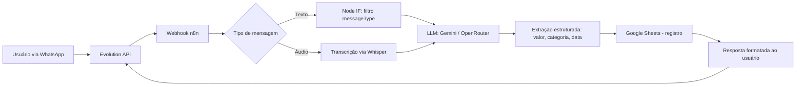

# 💰 Agente Financeiro via WhatsApp

Assistente de IA para controle financeiro pessoal, operado inteiramente via WhatsApp. O usuário registra gastos por mensagem de texto ou áudio, e o sistema categoriza, armazena e responde com resumos financeiros automaticamente.

> Projeto real desenvolvido para cliente autônomo. Dados e credenciais originais foram removidos/generalizados nesta documentação por confidencialidade.

## 🎯 Problema

Pequenos empreendedores e profissionais autônomos frequentemente perdem o controle de gastos por não terem tempo ou disciplina para usar planilhas ou apps financeiros tradicionais. O objetivo era criar uma forma de registro **tão simples quanto mandar uma mensagem no WhatsApp**.

## 🏗️ Arquitetura

## ⚙️ Como funciona

1. **Recepção da mensagem** — A Evolution API captura mensagens do WhatsApp e envia via webhook para o n8n.
2. **Filtro de tipo de mensagem** — Um node `IF` identifica se é texto, áudio ou imagem, direcionando o fluxo corretamente (esse foi um dos pontos mais delicados de debugar: o `messageType` do payload precisa ser tratado com cuidado para evitar loops ou respostas duplicadas).
3. **Processamento por IA** — O conteúdo é enviado a um modelo de linguagem (com troca dinâmica entre Gemini e modelos via OpenRouter, dependendo de custo/disponibilidade) que extrai valor, categoria e descrição do gasto.
4. **Persistência** — Os dados estruturados são gravados automaticamente em uma planilha do Google Sheets, funcionando como banco de dados leve e visualmente acessível ao cliente.
5. **Resposta automática** — O usuário recebe uma confirmação formatada, incluindo o resumo do gasto e, sob demanda, totais por categoria/período.

## 🧩 Desafios técnicos resolvidos

- **Gerenciamento de `sessionKey`** para manter contexto de conversa entre mensagens sem misturar sessões de diferentes usuários.
- **Tratamento de `messageType`** para evitar que o agente respondesse a eventos que não fossem mensagens diretas do usuário (ex: confirmações de leitura, status).
- **Troca de modelo de IA em tempo real** conforme limites de uso, sem interromper a experiência do usuário.
- **Webhook response handling** ajustado para garantir que o WhatsApp sempre recebesse confirmação de entrega, evitando reenvios duplicados.

## 🛠️ Stack

`n8n` · `Evolution API` · `Google Gemini` · `OpenRouter` · `Whisper (transcrição de áudio)` · `Google Sheets API`

## 📈 Resultado

Substituição completa do registro manual de gastos por um fluxo conversacional, com dados sempre organizados e acessíveis em tempo real — sem que o usuário precise sair do WhatsApp.
